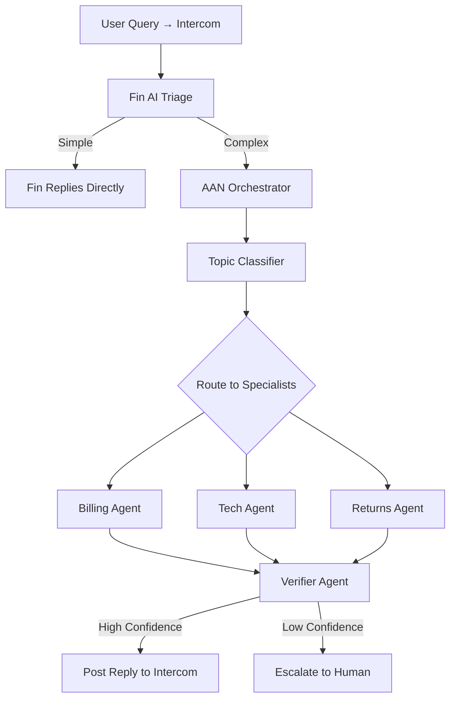

# Adaptive Agent Network (AAN) Customer Support System

[](https://github.com/tdevere/ai-customer-support/actions/workflows/ci-cd.yml)
[](https://opensource.org/licenses/MIT)
[](./SECURITY_ADVISORY.md)

A production-ready, plug-and-play **Adaptive Agent Network (AAN)** that augments **Intercom + Fin AI Agent** for specialized customer support. This system handles 70-80% of simple queries automatically via Fin, with AAN activating for topic-specialist needs, low-confidence outputs, or complex multi-topic cases.

> **🔒 Security Update (2024-02-18)**: All LangChain vulnerabilities patched. See [SECURITY_ADVISORY.md](./SECURITY_ADVISORY.md) for details.

## 🚀 Features

- **Multi-Agent Architecture**: Dynamic topic routing to specialized agents (Billing, Technical, Returns)
- **Intelligent Routing**: Automatic classification and routing based on query content
- **Confidence-Based Escalation**: Smart handoff to human agents when confidence < 70%
- **Intercom Integration**: Seamless webhook and data connector support
- **RAG Knowledge Base**: Azure AI Search-powered context retrieval
- **GDPR Compliant**: 7-day TTL on conversation data, minimal PII storage
- **Serverless Azure**: Fully managed infrastructure with auto-scaling
- **Plug-and-Play Agents**: Add new specialist agents in <1 hour via config

## 📋 Architecture



## 🛠️ Tech Stack

- **Orchestration**: LangGraph + LangChain
- **Backend**: Python 3.11 + Azure Functions
- **LLMs**: Azure OpenAI (GPT-4o, GPT-4o-mini)
- **Vector DB**: Azure AI Search
- **State Management**: Azure Cosmos DB
- **External Tools**: Stripe, Jira, Shopify APIs
- **Monitoring**: Azure Application Insights + LangSmith
- **IaC**: Terraform

## 📦 Project Structure

```
aan-intercom-support/
├── .github/workflows/     # CI/CD pipelines
├── agents/                # Specialist agents
│   ├── billing_agent.py
│   ├── tech_agent.py
│   ├── returns_agent.py
│   └── registry.yaml      # Agent configurations
├── orchestrator/          # Main orchestration logic
│   ├── graph.py          # LangGraph workflow
│   ├── supervisor.py     # Topic classifier
│   ├── verifier.py       # Confidence scorer
│   ├── escalator.py      # Human handoff
│   └── custom_answers.py # Hard-coded override layer
├── integrations/          # External service integrations
│   ├── conversations.py  # Platform-agnostic REST API
│   ├── intercom.py       # Webhook handler
│   └── tools/            # Stripe, Jira, Shopify tools
├── shared/                # Shared utilities
│   ├── config.py         # Configuration management
│   ├── memory.py         # State persistence
│   ├── rag.py            # RAG knowledge base
│   └── telemetry.py      # Application Insights wrapper
├── tests/                 # Comprehensive tests (287 tests, 100% coverage)
├── infra/                 # Terraform infrastructure
│   ├── main.tf
│   └── backend.tf        # Remote state backend (Azure Blob)
├── examples/              # Runnable usage examples
├── scripts/               # Developer tooling
│   ├── test_local.ps1    # Full CI pipeline locally (Windows/PowerShell)
│   ├── demo_local.py     # Mock server — demo without Azure credentials
│   └── demo.ps1          # Guided 4-scene demo runner
└── requirements.txt       # Python dependencies
```

## 🚀 Quick Start

### Prerequisites

- Python 3.11+
- Azure subscription
- Terraform 1.0+
- Azure CLI
- Intercom workspace

### 1. Clone Repository

```bash
git clone https://github.com/tdevere/ai-customer-support.git
cd ai-customer-support
```

### 2. Install Dependencies

```bash
python -m venv .venv
source .venv/bin/activate  # On Windows: .venv\Scripts\activate
pip install uv
uv pip install --system -r requirements.txt
```

### 3. Configure Environment

Create a `.env` file:

```bash
# Azure OpenAI
AZURE_OPENAI_ENDPOINT=https://your-instance.openai.azure.com
AZURE_OPENAI_API_KEY=your-api-key

# Azure Cosmos DB
COSMOS_ENDPOINT=https://your-cosmos.documents.azure.com:443/
COSMOS_KEY=your-cosmos-key

# Azure AI Search
AZURE_SEARCH_ENDPOINT=https://your-search.search.windows.net
AZURE_SEARCH_KEY=your-search-key

# Intercom
INTERCOM_ACCESS_TOKEN=your-intercom-token
INTERCOM_WEBHOOK_SECRET=your-webhook-secret

# External Services (optional)
STRIPE_API_KEY=your-stripe-key
JIRA_API_TOKEN=your-jira-token
JIRA_BASE_URL=https://your-company.atlassian.net
SHOPIFY_API_KEY=your-shopify-key
SHOPIFY_SHOP_URL=https://your-shop.myshopify.com

# Monitoring (optional — telemetry is no-op when absent)
APPINSIGHTS_CONNECTION_STRING=InstrumentationKey=your-key;...
```

### 4. Deploy Infrastructure

```bash
cd infra
terraform init
terraform plan -var="environment=dev"
terraform apply -var="environment=dev"
```

### 5. Deploy Function App

```bash
func azure functionapp publish func-aan-support-dev
```

### 6. Configure Intercom Webhook

1. Go to Intercom Settings → Webhooks
2. Add webhook URL: `https://your-function-app.azurewebsites.net/api/webhook`
3. Subscribe to: `conversation.user.replied`, `conversation.user.created`
4. Copy webhook secret to `.env`

## 🎬 Running the Demo

See every capability of the system **without any Azure credentials** using the local mock server.

**Terminal 1** — start the mock server (keep running):

```powershell
.venv\Scripts\python.exe scripts/demo_local.py
```

**Terminal 2** — run the guided 4-scene demo:

```powershell
.\scripts\demo.ps1
```

Or start the server automatically:

```powershell
.\scripts\demo.ps1 -StartServer
```

Once running, the interactive Swagger UI is available at:

```
http://localhost:8000/docs
```

For the full demo walkthrough, recorded output, and manual `curl`/PowerShell examples,  
see **[docs/DEMO.md](./docs/DEMO.md)**.

---

## 🧪 Testing

### Run All Tests

```bash
# Windows (PowerShell) — mirrors CI exactly
.\scripts\test_local.ps1

# Linux / macOS
pytest tests/ -v
```

### Run with Coverage

```bash
pytest tests/ --cov=. --cov-report=html --cov-fail-under=90
```

### Run Only a Specific Test File

```bash
pytest tests/test_supervisor.py -v
```

### Type Checking

```bash
mypy shared/ orchestrator/ agents/ integrations/ --ignore-missing-imports
```

## 📝 Usage

### Adding a New Specialist Agent

1. **Create Agent File**: `agents/new_agent.py`

```python
from typing import Dict, Any, List
from typing_extensions import TypedDict
from langchain_openai import AzureChatOpenAI
from langgraph.graph import StateGraph, END

class NewAgentState(TypedDict):
    query: str
    response: str
    confidence: float

def create_new_agent():
    # Define your agent logic
    workflow = StateGraph(NewAgentState)
    # Add nodes and edges
    return workflow.compile()

new_agent = create_new_agent()
```

2. **Update Registry**: `agents/registry.yaml`

```yaml
new_topic:
  name: "New Specialist"
  description: "Handles new topic queries"
  module: "agents.new_agent"
  agent_name: "new_agent"
  enabled: true
  tools:
    - tool_name_1
    - tool_name_2
  keywords:
    - keyword1
    - keyword2
```

3. **Deploy**: The agent is now available in <1 hour!

### Manual Testing

```python
from orchestrator.graph import run_aan_orchestrator

result = await run_aan_orchestrator(
    conversation_id="test-123",
    user_id="user-456",
    message="How do I cancel my subscription?",
    context={"customer_id": "cust_789"}
)

print(result)
```

## �️ Roadmap

### ✅ Completed (as of 2026-02-19)

| Capability | Detail |
|---|---|
| Multi-agent orchestration | LangGraph graph — classify → route → verify → respond/escalate |
| Specialist agents | Billing (Stripe), Tech (Jira), Returns (Shopify) |
| Platform-agnostic REST API | `POST /conversations`, `POST /conversations/{id}/messages`, `GET /conversations/{id}` |
| Resolution tracking | `in_progress` → `resolved_assumed` / `resolved_confirmed` / `escalated` |
| Custom-answers override layer | Hard-coded responses that short-circuit the LLM pipeline |
| Azure Monitor telemetry | OpenTelemetry wrapper — no-op without App Insights |
| X-Request-ID middleware | Trace ID on every API response |
| Config-driven agent registry | Add a new specialist in <1 hour via `agents/registry.yaml` |
| 292 tests / 100% coverage | Coverage gate enforced locally and in CI |
| mypy type checking | Integrated in CI, Makefile, and `test_local.ps1` |
| CI/CD hardened | All action versions pinned, Trivy scanning, coverage gate |
| Dependabot | Weekly pip + GitHub Actions update PRs |
| Terraform remote state | Azure Blob backend template in `infra/backend.tf` |
| Local demo mode | Zero Azure credentials — `scripts/demo_local.py` + `demo.ps1` |
| Docs | README, ARCHITECTURE, DEPLOYMENT, DEMO |

### 🔜 Next — Production Go-Live (~3 hours)

| Step | Owner | Est. time |
|---|---|---|
| Fill `local.settings.json` with real Azure creds | You | 1 h |
| Run `infra/main.tf` (`terraform apply`) | You | 30 min |
| Seed Azure AI Search knowledge base (`scripts/seed_knowledge_base.py`) | Next build | 2 h |
| Set `AZURE_CREDENTIALS_DEV` / `AZURE_CREDENTIALS_PROD` GitHub secrets | You | 30 min |
| Open PR: `copilot/add-adaptive-agent-network` → `main` | You | 5 min |

### 🔭 Future

| Feature | Priority |
|---|---|
| `scripts/seed_knowledge_base.py` — load support articles into Azure AI Search | High |
| End-to-end integration tests against live Azure sandbox | High |
| Performance benchmarking — validate p95 < 8 s | Medium |
| Email channel integration (Azure Communication Services) | Medium |
| Admin dashboard — conversation analytics + resolution rates | Medium |
| Multi-language support (Azure Translator) | Low |
| Proactive support (predict issues before customers report) | Low |

---

## �📊 Monitoring

### Application Insights

Access metrics at: Azure Portal → Application Insights

Key metrics:
- Request duration (target: <8s p95)
- Escalation rate (target: <10%)
- Success rate (target: >90%)
- Cost per query (target: <$0.05)

### LangSmith (Optional)

Set `LANGCHAIN_TRACING_V2=true` and configure API key for detailed trace logs.

## 💰 Cost Estimates

For 1,000 queries/day with 50% routed to AAN:

| Service | Monthly Cost |
|---------|--------------|
| Azure Functions | $5-10 |
| Azure OpenAI | $40-60 |
| Cosmos DB | $25 |
| Azure AI Search | $75 |
| Storage & KV | $2 |
| **Total** | **~$150** |

## 🔒 Security

- Managed Identity for Azure resource access
- All secrets stored in Azure Key Vault
- Webhook signature validation
- GDPR-compliant TTL (7 days)
- Encryption at rest and in transit

## 🤝 Contributing

1. Fork the repository
2. Create a feature branch
3. Make your changes
4. Add tests
5. Submit a pull request

## 📄 License

MIT License - see [LICENSE](LICENSE) file

## 🙏 Acknowledgments

- Built with [LangGraph](https://github.com/langchain-ai/langgraph)
- Powered by [Azure OpenAI](https://azure.microsoft.com/en-us/products/ai-services/openai-service)
- Integrated with [Intercom](https://www.intercom.com/)

## 📧 Support

For issues and questions:
- GitHub Issues: [Create an issue](https://github.com/tdevere/ai-customer-support/issues)
- Email: support@example.com

---

**Built with ❤️ for scalable, intelligent customer support**